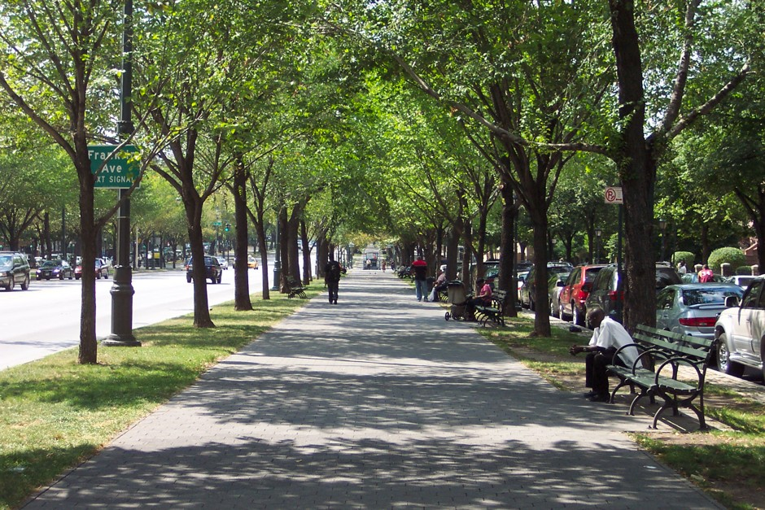
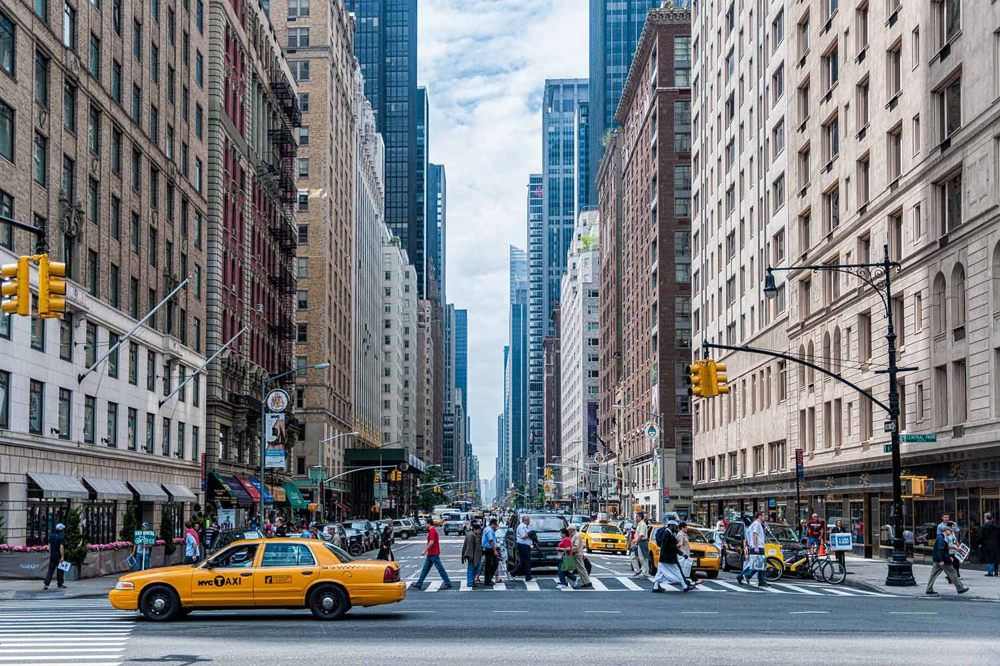
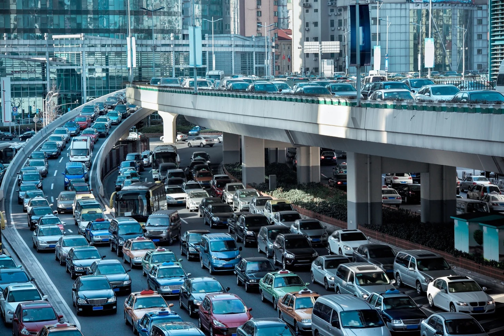
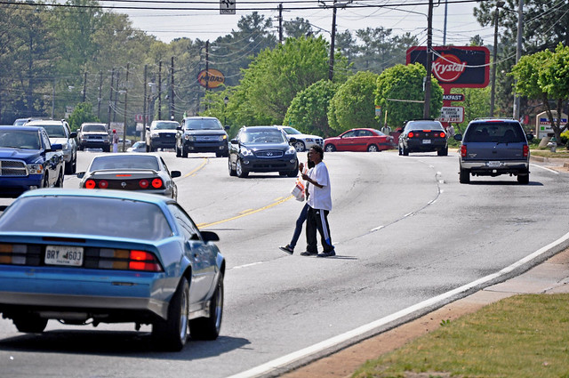

## **Walk the walk: The effect of neighborhood walkability on health**

 

<table style="table-layout: fixed; width: 70%">

  <tr>
    <td></td>
    <td></td>
  </tr>
  <tr>
    <td></td> 
    <td></td>
  </tr>
</table>
 

## Motivation

Urban planning of most US cities was designed around cars and not walking, and not everywhere in the US is walkable for its residents. The recent pandemic has further emphasized the important role that accessible green space and walkable neighborhoods play in our individual and collective physical activity and mental wellbeing. We want to learn about the National Walkability Index published by the EPA, and how the index relates to health outcomes. We also would like to explore ways to improve the index to make it more comprehensive. As five passionate walkaholics🚶🏻‍️, we want to promote walking and hope more people will enjoy walking.

