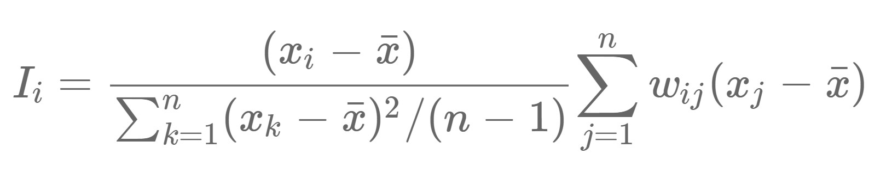

<style>
div.blue { background-color:aliceblue; border-radius: 5px; padding: 20px;}
</style>
<div class = "blue">

##### On this page, we will explore the National Walkability Index on the county-level across the United States. Also, we will take a closer look at the walkability in New York City and conduct exploratory spatial data analysis. 
</div>
<br>


## Interactive Map with National Walkability Index

#### Map Overview

For the National Walkability Index, we wanted to go beyond the [EPA’s current Walkability Map](https://www.arcgis.com/home/webmap/viewer.html?url=https%3A%2F%2Fgeodata.epa.gov%2Farcgis%2Frest%2Fservices%2FOA%2FWalkabilityIndex%2FMapServer&source=sd) and created the following interactive spatial visualization that demonstrates county-level walkability scores and the health outcomes prevalence. We utilized many geographic information systems (GIS) concepts and synthesized skills learned from both the Data Science I (BIOST P8105) and Public Health GIS (EHSC P8371) courses that we’re taking in the creation of this spatial visualization. 

When your mouse hover onto a county, the textbox displays the county name, National Walkability Index, and health outcomes percentage. These health outcomes are:

* High Cholesterol: High cholesterol among adults aged >=18 years who have been screened in the past 5 years
* Physical Inactivity: No leisure-time physical activity among adults aged >=18 years
* Mental Health: Mental health not good for >=14 days among adults aged >=18 years
* Physical Health: Physical health not good for >=14 days among adults aged >=18 years
* High Blood Pressure: High blood pressure among adults aged >=18 years


<details>
  <summary>Click to show code</summary>
  
```{r message=FALSE, warning=FALSE, fig.show='hide', results='hide'}
library(rjson)
library(leaflet)
library(tidyverse)
library(plotly)

# Read in cleaned datafile
walkability = read_csv("./data/merge_final.csv")

# Get the county-level .json file from the web
url = 'https://raw.githubusercontent.com/plotly/datasets/master/geojson-counties-fips.json'

counties = rjson::fromJSON(file = url)

# Set up the geographic projection for the map 
g = list(scope = 'usa',
         projection = list(type = 'albers usa'))

# Get the df for mean of walkability index by county
index_by_county = walkability %>% 
  mutate(fips_county = str_c(statefp, countyfp)) %>% 
  group_by(fips_county) %>% 
  summarise(ind_mean = round(mean(nat_walk_ind), 1))

# Get the df for mean of health outcome prevalence by county
hover_test_df = walkability %>%
  mutate(fips_county = str_c(statefp, countyfp)) %>% 
  group_by(fips_county, measure_id) %>%
  summarise(county_hlth = round(mean(data_value, na.rm = TRUE), 1)) %>%
  pivot_wider(names_from = "measure_id", values_from = "county_hlth") %>% 
  janitor::clean_names()

# Merge the two df by county-level FIPS
walkability_map = full_join(x = index_by_county, y = hover_test_df, by = "fips_county")

# Adding variable for hovertext
walkability_map$hover <- with(walkability_map, 
                            paste('<br>',
                                  "National Walkability Index (by County):", ind_mean, '<br>', 
                                  "% Health Outcomes (by County)", '<br>',
                                  "High Cholesterol:", highchol, '<br>',
                                  "Physical Inactivity:", lpa, '<br>',
                                  "Mental Health:", mhlth, '<br>',
                                  "Physical Health:", phlth, '<br>',
                                  "High Blood Pressure:", bphigh))

# Choropleth with hovertext of health outcomes by county by plotly
choropleth_map = plot_ly()

choropleth_map = choropleth_map %>% 
  add_trace(type = "choropleth",
            geojson = counties,
            locations = walkability_map$fips_county,
            z = walkability_map$ind_mean,
            text = walkability_map$hover,
            colorscale = "Viridis",
            reversescale = T, #to get reverse color scheme
            zmin = 1,
            zmax = 16,
            marker = list(line = list(width = 0)))

choropleth_map = choropleth_map %>%
  layout(title = "National Walkability Index in the US")

choropleth_map = choropleth_map %>% 
  layout(geo = g)

choropleth_map
```
</details>

```{r echo=FALSE, message=FALSE, warning=FALSE}
choropleth_map
```

## Exploratory Spatial Data Analysis for NYC


To further understand the National Walkability Index in a smaller spatial unit, we narrowed the exploration to **New York City**, where us five walkaholics reside. 

The first step is to get a general understanding of the walkability index in the City by creating a decriptive choropleth map on the census tract level. We focused on the following counties:

* Bronx County
* Kings County
* New York County
* Queens County
* Richmond County

<br>

### *Descriptive Choropleth Map for Walkability*

<details>
  <summary>Click to show code</summary>
  
```{r message=FALSE, warning=FALSE, fig.show='hide', results='hide'}
library(sf)
library(tmap)
library(tidyverse)
library(leaflet)
library(shinyjs)

# Read-in shapefile
choropleth_NYC <- st_read("./data/cluster_analysis/map_with_everything.shp", quiet = TRUE)

# Clean up and filter
choropleth_NYC = choropleth_NYC %>% 
  janitor::clean_names() %>% 
  mutate(nat_walk_i = as.numeric(nat_walk_i),
        nat_walk_i = round(nat_walk_i, digits = 1)) %>% 
  filter(stusps == "NY",
         namelsadco %in% c("Bronx County", "Kings County", "New York County", "Queens County", "Richmond County")) %>% 
  rename(median_income = s1903_c03) %>% 
  mutate(median_income = as.numeric(median_income))

choropleth_NYC = choropleth_NYC[!is.na(choropleth_NYC$nat_walk_i),]

# Time to map
tmap_mode("view")

tm_basemap("CartoDB.Positron") +
  tm_shape(choropleth_NYC) +
  tm_polygons(col = "nat_walk_i", 
              style = "fisher",
              n = 5,
              title = "National Walkability Index",
              palette = ("Greens"))

```
</details>

```{r echo=FALSE, message=FALSE, warning=FALSE}
# Time to map
tmap_mode("view")

tm_basemap("CartoDB.Positron") +
  tm_shape(choropleth_NYC) +
  tm_polygons(col = "nat_walk_i", 
              style = "fisher",
              n = 5,
              title = "National Walkability Index",
              palette = ("YlGn"))

#get different color palette: tmaptools::palette_explorer()
```

From this choropleth map, we can see that New York City is walkable overall. However, we want to further identify census tracts that are statistically significant hot spots, cold spots, and spatial outliers using clustering analysis. 


### *Clustering Analysis for Walkability*

#### Understanding the terms
As mentioned, we want to find NYC census tracts that are statistically significant hot spots, cold spots, and spatial outliers. To start, it is crucial to understand the terms.

* Hot spots/high positive clusters, **High-High**: census tracts that are high in walkability are surround by census tracts with high walkability index
* Cold spots/low positive clusters, **Low-Low**: census tracts that are low in walkability are surround by census tracts with low walkability index
* Spatial outliers:
  * **High-Low**: census tracts that are high in walkability are surround by census tracts with low walkability index
  * **Low-High**: census tracts that are low in walkability are surround by census tracts with high walkability index

#### Local Moran's I

To find these clusters, we will be using local Moran's I. The local spatial statistic Moran's I is calculated for each zone based on the spatial weights object used. The values returned include a Z-value, and may be used as a diagnostic tool. The statistic is: 

<center>

<br>

Essentially, the local Moran's I tells us the local indicator of spatial association or LISA statistic. We will use these LISA cluster indicators to map different walkability clusters in the NYC.

#### Defining Neighborhood for Spatial Weights

For local Moran's I, we also need to specify the spatial weights by defining neighborhood connectivity. The goal of this step is to identify nearest census tract around a specific census tract. We used the Queen's first order contiguity to establish neighborhood connectivity in the following analysis. 

If a census tract is within the threshold distance of the selected census tract, a 1 is given, otherwise a 0 is given. Neighborhoods are created based on which observations are judged “contiguous”.

**Queen's first order contiguity** suggests that, if a census tract share a vertex or a line segment with the selected census tract, they are given a weight of 1 (adjacent and are treated as a neighbor), else they are given a value 0 (nonadjacent and are not treated as a neighbor). 

Visually, it looks like this: 

<center>

<br>

Clearly defining the contiguity is needed to conduct the cluster analysis since we want to know what is considered as a neighboring census tract! 


#### Clustering Map

By having a basic understanding, we can plot the clustering map of walkability in NYC using Queen's first order contiguity and local Moran's I. 


<details>
  <summary>Click to show code</summary>
  
```{r message=FALSE, warning=FALSE, fig.show='hide', results='hide'}
library(rgeoda)
library(sf)
library(tmap)
library(tidyverse)
library(leaflet)

# Read-in shapefile
cluster_map <- st_read("./data/cluster_analysis/map_with_everything.shp", quiet = TRUE)

# Clean up and filter
cluster_map_clean = cluster_map %>% 
  janitor::clean_names() %>% 
  mutate(nat_walk_i = as.numeric(nat_walk_i),
        nat_walk_i = round(nat_walk_i, digits = 1)) %>% 
  filter(stusps == "NY",
         namelsadco %in% c("Bronx County", "Kings County", "New York County", "Queens County", "Richmond County")) %>% 
  rename(median_income = s1903_c03) %>% 
  mutate(median_income = as.numeric(median_income))

cluster_map_NYC = cluster_map_clean[!is.na(cluster_map_clean$nat_walk_i),]
  
# Queen 1st order weights matrix 
queen_w <- queen_weights(cluster_map_NYC, order = 1)

# Local Moran's I
lisa <- local_moran(queen_w, cluster_map_NYC["nat_walk_i"],
                    permutations = 9999)

# Get cluster column and join it to shp
cluster_map_NYC$cluster <- as.factor(lisa$GetClusterIndicators())
str(cluster_map_NYC)

# Add labels to clusters
levels(cluster_map_NYC$cluster) <- lisa$GetLabels()

# We want the GeoDa colors
lisa_colors <- lisa_colors(lisa)

# Recode clusters using tidyverse (dyplr)
cluster_map_NYC %>% 
  mutate(cluster = recode_factor(.x = cluster,
                                  `Undefined` = "Not significant",
                                  `Isolated` = "Not significant")) -> cluster_map_NYC

# Map the clusters with a basemap
tmap_mode("view")

tm_basemap("CartoDB.Positron") +
  tm_shape(cluster_map_NYC) +
  tm_polygons(col = "cluster", 
              palette =  c("#eeeeee", 
                      "#FF0000",
                      "#0000FF",
                      "#a7adf9",
                      "#f4ada8"),
              alpha = .8,
              title = "Clusters",
              border.col = "black",
              border.alpha = .9) 
```
</details>


```{r echo=FALSE, message=FALSE, warning=FALSE}
# Map the clusters with a basemap
tmap_mode("view")

tm_basemap("CartoDB.Positron") +
  tm_shape(cluster_map_NYC) +
  tm_polygons(col = "cluster", 
              palette =  c("#eeeeee", 
                      "#FF0000",
                      "#0000FF",
                      "#a7adf9",
                      "#f4ada8"),
              alpha = .8,
              title = "Clusters",
              border.col = "black",
              border.alpha = .9) 
```


#### Highlights & Importance

Look at Manhattan, we can see that there are several High-High clusterings (i.e., census tracts that are high in walkability are surround by census tracts with high walkability index) in the Midtown and SOHO area. Some parts of Queens, such as Flushing and Forest Hills, also indicates a High-High clustering. 

However, part of the Bronx shows the Low-Low clustering, where census tracts that are low in walkability are surround by census tracts with low walkability index. The Low-Low clustering in Brooklyn, on the other hand, might be due to the location of the JFK airport. 

You might be wondering, what is the importance of finding these statistically significant hot spots and cold spots of walkability in the census tract level?

Reflecting back to the primary goal of the project, which is to highlight the connections between walkability, the built environment, and community-level health, identifying these clusters can help policy makers to put there attentions on those **Low-Low** areas. The **High-High** neighborhoods are doing a good job in building a walkable environment and the **Low-Low** areas will benefit a lot by improving built environment infrastructure to make the community more walkable for all. 


#### Extra Resources

You can get more information about local Moran's I [here](http://ceadserv1.nku.edu/longa/geomed/ppa/doc/LocalI/LocalI.htm#:~:text=Local%20Moran's%20I%20is%20a,spatial%20association%20or%20LISA%20statistic.), and read about [R package for analyzing spatial data](https://onlinelibrary.wiley.com/doi/10.1111/gean.12319).

We referenced [this page](https://rpubs.com/corey_sparks/105700) when defining Queen's first order. 


