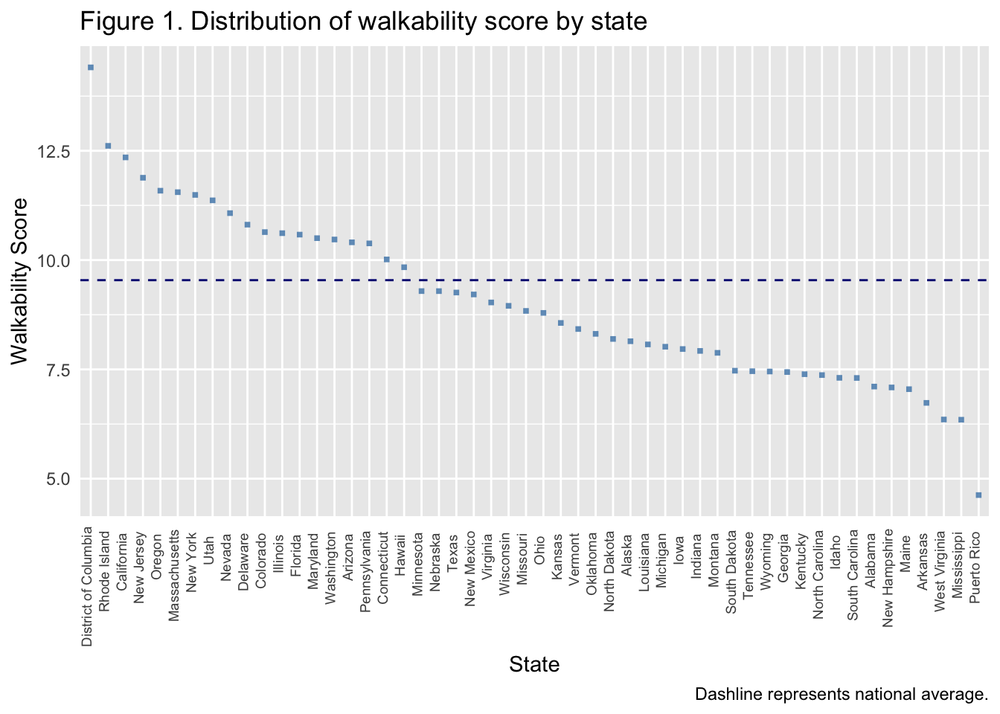
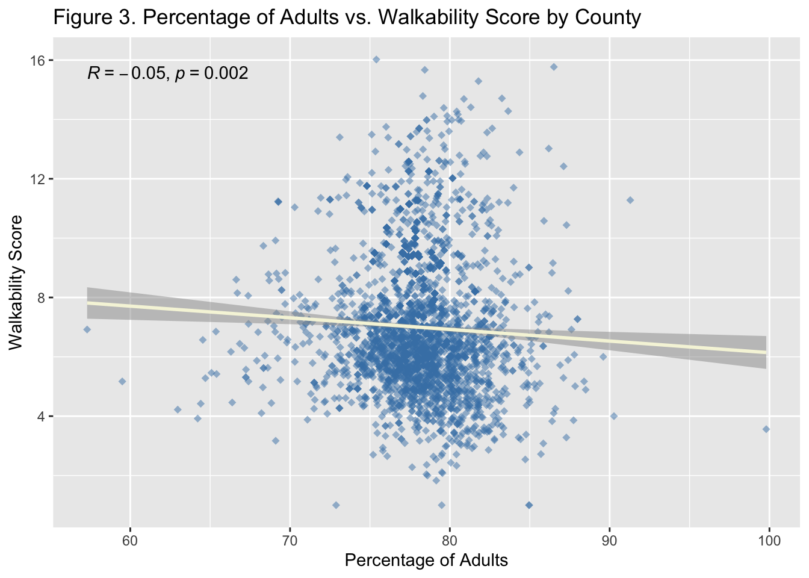
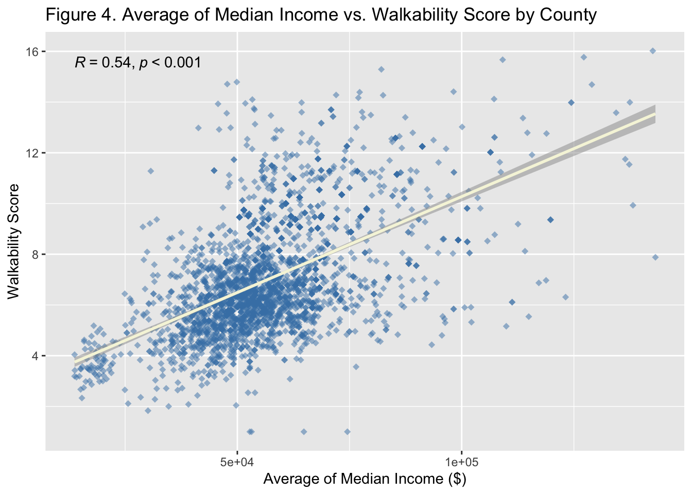
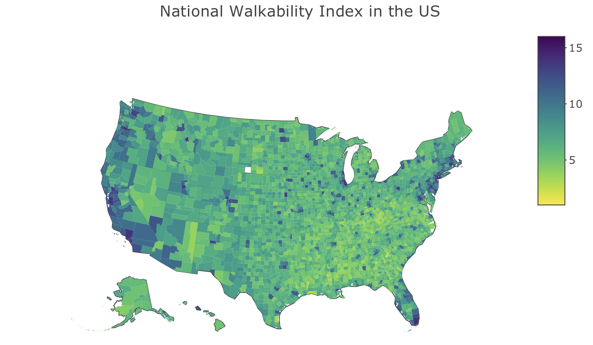
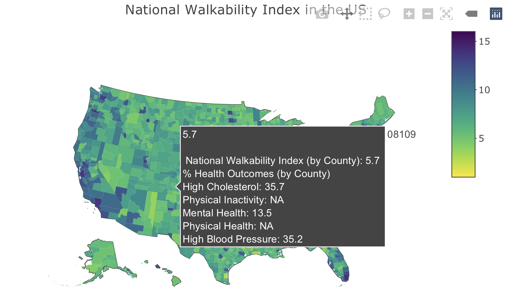

<style>
div.blue { background-color:aliceblue; border-radius: 5px; padding: 20px;}
</style>
<div class = "blue">

## Project Report
### Walk the walk: The effect of neighborhood walkability on health
##### Amy Yeung, Winston Luhur, Sophie Zhang, Shirley Liang, Wenyan Ma

</div>

<br>

```{r setup, include=FALSE}

library(tidyverse)

```

## Introduction

### Our Motivation
Urban planning around the US is increasingly [designed around cars and not walking](https://www.vox.com/features/23191527/urban-planning-friendship-houston-cars-loneliness), and not everywhere in the US is walkable for its residents. This trend accelerated in the post-war era, with: 

* suburbanization — combined with [racist redlining and white flight](https://theecologist.org/2016/mar/07/racist-housing-how-postwar-suburban-development-led-todays-inner-city-lead-poisoning) — and the subsequent [urban decay](https://en.wikipedia.org/wiki/Urban_decay#:~:text=Urban%20 decay%20)
* lobbying by the car industry, which has reduced the prevalence of public transport and walkable neighborhoods in favor of [highways](https://islandpress.org/books/autonorama),

and many other factors.

The recent pandemic has only further emphasized the important role that accessible built environments—including walkable neighborhoods—play in our [individual and collective physical health and mental wellbeing](https://phys.org/news/2022-01-inclusion-walkability-key-rebuilding-cities.html). 

To explore the landscape of walkability in the US and New York City, we wanted to learn more about the [National Walkability Index](https://www.epa.gov/smartgrowth/smart-location-mapping#walkdability) published by the Environmental Protection Agency (EPA) and how it relates to health outcomes. Additionally, we wanted to explore potential ways to improve the EPA’s walkability index to make it more comprehensive. While other walkability indices in the US exist, such as the [Walk Score](https://www.walkscore.com/cities-and-neighborhoods/), none are available at the census block level, or the indices are created specifically for a study. One literature review you can peruse is [here](https://www.mdpi.com/2071-1050/14/17/10933).

As five *passionate walkaholics*🚶🏻‍♂️ and current public health graduate students, we also wanted to explore the intersection of our shared interests. We hope that our project will help to highlight the connections between walkability, the built environment, and community-level health in order to promote change towards a more accessible (and walkable) future. We also hope that our project and findings will spark the same passion we have in walking in others.

<br>

### Related Work
Various studies have explored the relationship between neighborhood walkability and health, such as [Watson et al.’s](https://doi.org/10.1016/j.ypmed.2020.106122) and [Makhlouf et al.’s research](https://doi.org/10.1016/j.cpcardiol.2022.101533) at various levels of census subdivisions across the US; and have found that higher neighborhood walkability scores were associated with a greater prevalence of health-promoting behaviors and lower risk for cardiovascular disease. [Other studies](https://doi.org/10.1080/10511482.2022.2099937) have focused on historical gentrification and mobility on neighborhood walkability and environmental pollution. 

A [number](https://doi.org/10.1016/j.landurbplan.2011.05.002) [of studies](https://doi.org/10.1016/j.envint.2011.07.004) have also examined the impacts of green space (for example, neighborhood parks) on physical and mental health. While studies do find the expected positive relationship between number of and ease of access to green spaces and health outcomes, the results are not clear-cut and depend on various intersections with socioeconomic factors, such as income.

Though some studies have looked into the relationship between NWI and health outcomes, few have explored multiple health outcomes at the national and city-level. Moreover, further work is required to fully understand the complex relationship between neighborhood walkability — and the built environment as a whole — on community health, and its complex ties to systemic inequities and racist post-war urban policies.

<br>

### Initial Questions
Our project explores neighborhood walkability using the EPA’s [National Walkability Index (NWI) ](https://www.epa.gov/smartgrowth/smart-location-mapping#walkability) — a nationwide geographic data resource which ranks block groups according to their relative walkability, which we had learned about through our coursework. Through our research, we hope to highlight various health outcomes which are associated with walkability score; and the potential that increasing walkability can have on environmental and health equity in the future.

Our initial questions were centered around how the walkability of a neighborhood might impact health outcomes. Particularly, is the EPA walkability score of an area significantly associated with various neighborhood health outcomes (such as high blood pressure and mental health)? How does walkability score vary across the US? Is there significant spatial clustering of walkability scores in NYC? Broadly, we aimed to explore the myriad of ways in which neighborhood walkability is connected to space, place, and health.

For more, explore the website that accompanies this report [here](index.html) and the underlying website code [here](https://github.com/ay2543/walkability.io) .

<br>

### [Project Proposal](proposal.html)
Our initial proposal is linked [here](proposal.html) for reference. 

<br>
<br>

## Data Sources and Cleaning
### Data Sources
#### 2021 National Walkability Index (EPA NWI), US Environmental Protection Agency

The 2021 [National Walkability Index](http://edg.epa.gov/metadata/catalog/search/resource/details.page?uuid=%7B251AFDD9-23A7-4068-9B27-A3048A7E6012%7D) from the EPA provides walkability scores based on a simple formula that ranks selected indicators from the Smart Location Database (which summarizes 90 indicators associated with the built environment) that have been demonstrated to affect the propensity of walk trips. Currently, the National Walkability Index dataset ranks each block group relative to all other block groups in the United States on a scale from 0-20; and data can be aggregated to larger spatial units using Federal Information Processing Standards (FIPS) codes.

* [Methodology](https://www.epa.gov/sites/default/files/2021-06/documents/national_walkability_index_methodology_and_user_guide_june2021.pdf)

* [Codebook](https://www.epa.gov/sites/default/files/2021-06/documents/epa_sld_3.0_technicaldocumentationuserguide_may2021.pdf)

* Variables of interest:
+ `FIPS code`: a unique identifier for geographic areas
+ `National Walkability Index`: a relative scale of walkability, ranging from 0-20

<br>

#### 2020 American Community Survey (ACS), US Census Bureau

The [American Community Survey (ACS)](https://data.census.gov/table?tid=ACSDP1Y2021.DP05) is an annual, nationwide survey conducted by the US Census Bureau and produces information on social, economic, housing, and demographic characteristics about our nation's population every year. This information is a vital tool that communities can use to see how they are changing across the years.

* [Methodology](https://www.census.gov/content/dam/Census/library/publications/2020/acs/acs_general_handbook_2020.pdf)

* [Codebook](https://www.census.gov/programs-surveys/acs/technical-documentation/code-lists.2020.html#list-tab-NZBIUOT6KFYGCOIOAE)

* Variables of interest (in percentage expect median household income):
+ `Age`: Age >= 18 years
+ `Sex`: Male or female
+ `Race/ethnicity`: White, Black or African American, Latino or Hispanic, Asian, American Indian or American Native, 2+ races
+ `Median household income`: Median household income (in dollars)

<br>
#### 2020 Behavioral Risk Factor Surveillance System (BRFSS), Centers for Disease Control and Prevention

[The Behavioral Risk Factor Surveillance System (BRFSS)](https://chronicdata.cdc.gov/500-Cities-Places/PLACES-Local-Data-for-Better-Health-Census-Tract-D/cwsq-ngmh/data) is an annual, nationwide system of health-related telephone surveys conducted by the Centers for Disease Control and Prevention (CDC) which collects information about US residents regarding their health-related risk behaviors, chronic health conditions, and use of preventive services. Established in 1984 with 15 states, BRFSS now collects data in all 50 states as well as the District of Columbia and three US territories. BRFSS completes more than 400,000 adult interviews each year, making it the largest continuously conducted health survey system in the world.

* [Methodology](https://www.cdc.gov/pcd/issues/2022/21_0459.htm)

* Codebooks
+ [Codebook 1](https://www.cdc.gov/places/measure-definitions/health-status/index.html)
+ [Codebook 2](https://www.cdc.gov/places/measure-definitions/unhealthy-behaviors/index.html)
+ [Codebook 3](https://www.cdc.gov/places/measure-definitions/health-outcomes/index.html)

* Variables of interest:
+ `High Cholesterol`: Prevalence of high cholesterol among adults aged >=18 years who have been screened in the past 5 years
+ `Physical Inactivity`: Prevalence of no leisure-time physical activity among adults aged >=18 years
+ `Mental Health`: Prevalence of mental health not good for >=14 days among adults aged >=18 years
+ `Physical Health`: Prevalence of physical health not good for >=14 days among adults aged >=18 years
+ `High Blood Pressure`: Prevalence of high blood pressure among adults aged >=18 years
  
*Note: Cholesterol and blood pressure status is based on physician diagnosis, physical health, physical inactivity and mental health are based on self-report*

<br>

### Additional Data Considerations
#### Spatial units
For our variables of interest, we selected datasets that contained spatial (geographic) information. All variables were analyzed at the **census tract** level, with population sizes ranging from ~1000 to 4000 people.

Since walkability data was provided at a census block level (which is narrower than the census tract level), we took the average walkability indices of census blocks within a census tract for analysis for consistency with geographic data for other variables.

In order to create a [choropleth map of walkability scores across the US](map.html), we additionally aggregated census tract-level walkability to the county-level.
  
{#id .class width=80% height=80%}

<br>

#### Temporality
We used the latest 2021 National Walkability Index data, and ACS demographics and BRFSS health outcomes datasets from 2020.

Though our outcome data precede our exposure data, we believe that this is acceptable given the specific circumstances surrounding our data. For one, the EPA National Walkability Index is updated infrequently; the last major update before 2021 was [in 2014](https://www.epa.gov/sites/default/files/2021-06/documents/epa_sld_3.0_technicaldocumentationuserguide_may2021.pdf). Since physical neighborhood attributes related to walkability (such as street density and transit accessibility) change slowly — often over a span of many years — we argue that walkability data from a nearer year like 2021 will better capture the physical walking conditions of neighborhoods in 2020 compared to using an older 2014 version of the walkability index dataset.

However, we recognize that there is a discrepancy in timing across datasets, so we plan to limit our analysis to a cross-sectional design and will interpret our findings with caution.

<br>

### [Data Cleaning](cleaning.html)

#### Walkability Data
We explored the original dataset from Environmental Protection Agency's information on Walkability Index. We first added leading zeros for all Federal Information Processing Standard (FIPS) codes, which is the numbers that uniquely identify geographic areas. For the FIPS codes, we combined state codes, county codes and tract FIPS into an 11-digit code that is used for future analysis.  Then, we selected relevant variables (FIPS code and National Walkability Index) used in this project. 


```{r}
#Added leading zeros for all Federal Information Processing Standard (FIPS) codes
#Combined state, county and tract FIPS into an 11-digit code 
walkability_raw = read_csv("./data/EPA_SmartLocationDatabase_V3_Jan_2021_Final.csv")

walkability_new = walkability_raw %>% 
  janitor::clean_names() %>% 
  mutate(statefp = str_pad(statefp, width = 2, pad = "0"),
         countyfp = str_pad(countyfp, width = 3, pad = "0"),
         tractce = str_pad(tractce, width = 6, pad = "0"),
         fips = str_c(statefp, countyfp, tractce, blkgrpce, sep = "")) %>% 
  select(fips, everything(), -objectid)

#Selected relevant variables
walkability_clean = walkability_new %>% 
  select(fips, statefp, countyfp, tractce, blkgrpce, nat_walk_ind, csa_name) %>% 
  mutate(location_name = str_c(statefp, countyfp, tractce, sep = ""))
  
```


#### Demographics Data
We got the geographical related demographic data from The American Community Survey (ACS) for 2020. We created a census tract column derived from the geo_id column to match with walkability dataset. Then, we selected the five demographic variables of interest: age, sex, race/ethnicity, and median household income. 
  
## Demographic Data - ACS 2020
### Age, Gender, and Race
```{r}
demo_raw = read_csv("./data/ACSDP5Y2020.DP05-Data.csv")

#removed second row with detailed column names
#removed columns for annotations and margins of error
#created a census tract column derived from the geo_id column (removed the "1400000US" at the beginning of each entry) to match with other data sets
demo_clean = demo_raw %>% 
  slice(-1) %>% 
  janitor::clean_names() %>%
  select(-ends_with(c("ea", "m", "ma"))) %>% 
  mutate(geo_clean = geo_id, 
         geo_clean = str_replace(geo_clean, "^1400000US", "")) %>% 
  select(geo_clean, dp05_0002pe, dp05_0003pe, dp05_0021pe, dp05_0037pe, dp05_0038pe, dp05_0039pe, dp05_0044pe, dp05_0058pe, dp05_0071pe)

```

#### Median household income 
```{r}
income_raw = read_csv("./data/ACSST5Y2020.S1903-Data.csv")

income_clean = income_raw %>% 
  janitor::clean_names() %>%
  select(geo_id, name, s1903_c03_001e) %>% 
  slice(-1) %>% 
  mutate(geo_clean = geo_id, 
         geo_clean = str_replace(geo_clean, "^1400000US", "")) %>% 
  select(geo_clean, everything())

```


#### Health Outcomes Data
We found the health outcomes data related demographic data from Behavioral Risk Factor Surveillance System (BRFSS) for 2020. We created a census tract column derived from the geolocation column to match with walkability dataset. After removed footnote variables, we filtered to relevant health outcomes: high cholesterol, physical health, blood pressure, physical inactivity, and mental health.


## Health Outcome Data - BRFSS

```{r}
# raw data with all health outcomes
health_df = read_csv("./data/PLACES__Local_Data_for_Better_Health__Census_Tract_Data_2022_release.csv")

health_new = health_df %>% 
  janitor::clean_names() %>%
  mutate(location_name = str_pad(location_name, width = 11, pad = "0"),
         geolocation = str_replace(geolocation, "^POINT ", ""),
         geolocation = str_replace(geolocation, "^\\(", ""),
         geolocation = str_replace(geolocation, "\\)$", "")) %>% 
  separate(geolocation, into = c("lat", "long"), sep = " ")
  
```

#### Further cleaning
```{r}

#For health outcome, we are focusing on 5 outcomes that are likely to be related to walkability 
health_clean = health_new %>% 
  filter(measure_id == c("BPHIGH", "PHLTH", "LPA", "MHLTH", "HIGHCHOL")) %>% 
  select(location_name, lat, long, measure, data_value, data_value_type, data_value_unit, measure_id)
```


##### Cleaned Dataset for Analysis Use
After cleaning all three data sources, we merged the dataset by geographical locations. Then we outputed the cleaned data as csv. To be used for data analysis. 
  
##Merge
```{r}
# merging walkability and health outcomes
merge1 = full_join(x = walkability_clean, y = health_clean, by = "location_name")

#mergeing demographic into one df - age&race + median household income
merge2 = full_join(demo_clean, income_clean, by = "geo_clean")
  
merge2 = merge2 %>% 
  mutate(location_name = geo_clean) 

# merge merge1 and merge2
merge_final = full_join(x = merge1, y = merge2, by = "location_name")

merge_final = merge_final %>% 
  rename(sex_male = dp05_0002pe,
         sex_female = dp05_0003pe,
         age_18plus = dp05_0021pe,
         race_white = dp05_0037pe,
         race_black = dp05_0038pe,
         race_aian = dp05_0039pe,
         race_asian = dp05_0044pe,
         race_2_plus = dp05_0058pe,
         race_hispanic = dp05_0071pe,
         median_income = s1903_c03_001e) %>% 
  pivot_longer(names_to = "race",
               values_to = "percent_race",
               cols = starts_with("race"),
               names_prefix = "race_") %>% 
  select(-data_value_type, -data_value_unit)

write_csv(merge_final, "./data/merge_final.csv")

```


<br>
<br>

## [Exploratory analysis](explore.html)
To begin, we explored the associations between various social demographics, walkability, and health outcomes across the United States. 

<br>

### Demographics and Walkability
First, we looked at overall statistics of demographics and walkability in the United States. The average walkability score, percentage of female, percentage of male, percentage of adults (age greater than 18), average median income, percentage of each race, and percentage of more than 2 races were included in the table 1. Then, we have the same statistics on the interactive tables showing results for each state and county in table 2 and table 3. The mean walkability score is 9.54, which is below average walkable according to the National Walkability Index score ranging from 1 to 20. The percentage of females and male is balanced around 50%. The percentage of adults, which is older than 18 years old, is 78.23%. The average median income in this dataset is $68,387.44. Regarding race, there are 70.49% White, 17.37% Hispanic, 13.58% Black, 4.91% Asian, 0.9% American Indian and Alaska Native, and 4.95% who have more than 2 races. We also plotted the walkability score for each state in figure 1. The highest walkability score is from the District of Columbia and the lowest walkability score is from Puerto Rico. 

{#id .class width=60% height=60%}

```{r, warning=FALSE, eval = FALSE}
#Load library
library(tidyverse)
library(DT)
library(dplyr)
library(ggplot2)
library(ggpmisc)
library(ggpubr)

#Explore using final cleaned data
explore_df = read_csv("./data/merge_final.csv")

#Mutate char into num
explore_df = explore_df %>% mutate(sex_female = as.numeric(sex_female), sex_male = as.numeric(sex_male), age_18plus = as.numeric(age_18plus), median_income = as.numeric(median_income), percent_race = as.numeric(percent_race)) %>% separate(name, c("census_track","county", "state"), ",")

#Filter out variables needed for demographics
demographics_df = explore_df %>% select(sex_female, sex_male, age_18plus, median_income, race, percent_race, county, state, nat_walk_ind)

```

```{r, warning=FALSE, eval = FALSE}

#Get overall demographics statistics
overall_demographics = data.frame(
  Variables = c("Average Walkability Score", "Percentage of Female", "Percentage of Male", "Percentage of Adults", "Average of Median Income ($)", "Percentage of White", "Percentage of Hispanic", "Percentage of Black", "Percentage of Asian", "Percentage of American Indian and Alaska Native", "Percentage of 2+ Races"),
  Results = c((mean(demographics_df$nat_walk_ind, na.rm = TRUE)),
              (mean(demographics_df$sex_female, na.rm = TRUE)),
              (mean(demographics_df$sex_male, na.rm = TRUE)), 
              (mean(demographics_df$age_18plus, na.rm = TRUE)), 
              (mean(demographics_df$median_income, na.rm = TRUE)), 
              (mean((demographics_df %>% filter(race == "white"))$percent_race, na.rm = TRUE)), 
              (mean((demographics_df %>% filter(race == "hispanic"))$percent_race, na.rm = TRUE)),
              (mean((demographics_df %>% filter(race == "black"))$percent_race, na.rm = TRUE)),
              (mean((demographics_df %>% filter(race == "asian"))$percent_race, na.rm = TRUE)), 
              (mean((demographics_df %>% filter(race == "aian"))$percent_race, na.rm = TRUE)),
              (mean((demographics_df %>% filter(race == "2_plus"))$percent_race, na.rm = TRUE)))
)
overall_demographics = overall_demographics %>% mutate(across(where(is.numeric), ~ round(., 2)))

```


```{r, warning=FALSE, eval = FALSE}

#Print table
datatable(overall_demographics, 
          rownames = FALSE, 
          caption = htmltools::tags$caption(style = 'caption-side: top; text-align: left;', 
                    'Table 1: ', htmltools::em('Overall demographics and walkability statistics of the dataset.')), 
          options = list(dom = 't', pageLength = 11, columnDefs = list(list(className = 'dt-center', targets = "_all"))))
          
```

  
```{r, warning=FALSE, eval = FALSE}

#Filter out state and walkability score
walkability_df = explore_df %>% select(state, nat_walk_ind) %>% group_by(state) %>% summarise_each(funs(mean(., na.rm = TRUE))) 

#Delete NA from states 
walkability_df = walkability_df[!is.na(walkability_df$state),]

#Plot the distribution of walkability
walkability_plot = walkability_df  %>% mutate(state = fct_reorder(state, desc(nat_walk_ind))) %>% ggplot(aes(y = nat_walk_ind, x = state), ordered = TRUE) +
  geom_point(shape = "square", color = "steelblue", size = 1, alpha = 0.8) +
  labs(         
    x = "State",
    y = "Walkability Score",
    title = "Figure 1. Distribution of walkability score by state",
    caption = "Dashline represents national average.") + theme(axis.text.x = element_text(angle = 90, vjust = 0.1, hjust=0.9, size = 7), axis.ticks = element_blank()) + 
  geom_hline(yintercept=9.54, linetype="dashed", color = "Navy")

```

```{r, warning=FALSE, eval = FALSE}

#Avg of demographics by state
state_demographics = demographics_df %>% 
  group_by(state) %>% 
  summarise_each(funs(mean(., na.rm = TRUE))) %>% 
  select(-c(race, percent_race,county))

#Avg of race by state
state_demographics_race = demographics_df %>% 
  group_by(state, race) %>% 
  summarise_each(funs(mean(., na.rm = TRUE))) %>% 
  select(c(state, race, percent_race)) %>% 
  pivot_wider(names_from = "race",
               values_from = "percent_race")

#Merge two dataframe
state_demographics_merge = inner_join(state_demographics, state_demographics_race, by = "state") %>% 
  mutate(across(where(is.numeric), ~ round(., 2))) %>% 
  relocate(state, nat_walk_ind, sex_female, sex_male, age_18plus, median_income, white, hispanic, black, asian, aian)

#Delete the row with NA
state_demographics_merge = state_demographics_merge[-53,]

```
 
```{r, warning=FALSE, eval = FALSE}

#Print table
datatable(state_demographics_merge, 
          rownames = FALSE, 
          colnames = c('State', 'Average Walkability Score', 'Percentage of Female', 'Percentage of Male', 'Percentage of Adults', 'Average of Median Income ($)', 'Percentage of White', 'Percentage of Hispanic', 'Percentage of Black', 'Percentage of Asian', 'Percentage of American Indian and Alaska Native', 'Percentage of more than 2 Races'),
          caption = htmltools::tags$caption(style = 'caption-side: top; text-align: left;', 
                    'Table 2: ', htmltools::em('Demographics and walkability statistics of the dataset by state.')), 
          options = list(order = list(list(2, 'desc')), columnDefs = list(list(className = 'dt-center', targets = "_all"))))

```

```{r, warning=FALSE, eval = FALSE}

#Avg of demographics by county
county_demographics = demographics_df %>% 
  group_by(county) %>% 
  summarise_each(funs(mean(., na.rm = TRUE))) %>% 
  select(-c(race, percent_race, state))

#Avg of race by county
county_demographics_race = demographics_df %>% 
  group_by(county, race) %>% 
  summarise_each(funs(mean(., na.rm = TRUE))) %>% 
  select(c(county, race, percent_race)) %>% 
  pivot_wider(names_from = "race",
              values_from = "percent_race")

#Grab state name
state_name = demographics_df %>% select(c(state,county)) %>% distinct()

#Merge county level data
county_demographics_merge = inner_join(county_demographics, county_demographics_race, by = "county") %>% 
  mutate(across(where(is.numeric), ~ round(., 2))) 

#Add state name into dataframe
county_demographics_merge = left_join(county_demographics_merge, state_name,by = "county", all.x = TRUE) %>%
  relocate(county, state, nat_walk_ind, sex_female, sex_male, age_18plus, median_income, white, hispanic, black, asian, aian) %>% drop_na()

```

```{r, warning=FALSE, eval = FALSE}

#Print table
datatable(county_demographics_merge, 
          rownames = FALSE, 
          colnames = c('County', 'State','Average Walkability Score', 'Percentage of Female', 'Percentage of Male', 'Percentage of Adults', 'Average of Median Income ($)', 'Percentage of White', 'Percentage of Hispanic', 'Percentage of Black', 'Percentage of Asian', 'Percentage of American Indian and Alaska Native', 'Percentage of more than 2 Races'),
          caption = htmltools::tags$caption(style = 'caption-side: top; text-align: left;', 
                    'Table 3: ', htmltools::em('Demographics and walkability statistics of the dataset by county')), 
          options = list(
            order = list(list(3, 'desc')),
            columnDefs = list(list(className = 'dt-center', targets = "_all"))))

```

<br>

### Health Outcomes
Second, we looked at the five health outcomes related to walkability. The national prevalence of the health outcome, average walkability score, percentage of female, percentage of male, percentage of adults (age greater than 18), average median income, percentage of each race, and percentage of more than 2 races were explored. Below, we report the prevalence of health outcomes in the United States is shown below:

* The prevalence of high blood pressure is 32.65%
* The prevalence of high cholesterol who have been screened in the past 5 years is 31.98%
* The prevalence of mental health not good for over 14 days is 15.09%
* The prevalence of no leisure-time physical activity is 24.68%
* The prevalence of physical health not good for over 14 days is 10.80%

The average walkability score for all five health outcomes are similar around 9.5 (below average walkability). Other demographics for each of the five health outcomes are also similar to the national average. 

{#id .class width=80% height=80%}

```{r, warning=FALSE, eval=FALSE}

#Filter out variables needed for health outcome analysis
health_df = explore_df %>% select(sex_female, sex_male, age_18plus, median_income, race, percent_race, county, state, nat_walk_ind, measure, data_value) %>% 
  group_by(measure) %>% 
  summarise_each(funs(mean(., na.rm = TRUE))) %>% 
  select(-c(race, percent_race, county, state)) 

#Orgnize race info for health outcome analysis
health_df_race = explore_df %>% 
  group_by(measure, race) %>% 
  summarise_each(funs(mean(., na.rm = TRUE))) %>% 
  select(c(measure, race, percent_race)) %>% 
  pivot_wider(names_from = "race",
              values_from = "percent_race")

#Merge two dataframes
health_df = inner_join(health_df, health_df_race, by = "measure") %>% 
  mutate(across(where(is.numeric), ~ round(., 2))) %>% 
  relocate(measure, data_value, nat_walk_ind, sex_female, sex_male, age_18plus, median_income, white, hispanic, black, asian, aian)

#Delete NA health outcome and transpose
health_df = health_df[-6,]
health_df = t(health_df)

#Change row names
rownames(health_df) <- c("Health Outcome Measurments","Prevalence of Health Outcome (%)","Average Walkability Score","Percentage of Female", "Percentage of Male", "Percentage of Adults", "Average of Median Income ($)", "Percentage of White", "Percentage of Hispanic", "Percentage of Black", "Percentage of Asian", "Percentage of American Indian and Alaska Native", "Percentage of 2+ Races")

#Dataframe for making the table only
health_df_table = health_df[-1,]

```

```{r, warning=FALSE, eval=FALSE}

#Print table
datatable(health_df_table, 
          rownames = TRUE, 
          colnames = c('High blood pressure', 'High cholesterol who have been screened in the past 5 years','Mental health not good for over 14 days', 'No leisure-time physical activity', 'Physical health not good for over 14 days'),
          caption = htmltools::tags$caption(style = 'caption-side: top; text-align: left;', 
                    'Table 4: ', htmltools::em('Overall Health Outcome statistics of the dataset')), 
          options = list(
            dom = 't', pageLength = 12,
            columnDefs = list(list(className = 'dt-center', targets = "_all"))))

```

```{r, warning=FALSE, eval=FALSE}

#Filter out state level health outcome data
health_df_state = explore_df %>% select(sex_female, sex_male, age_18plus, median_income, race, percent_race, county, state, nat_walk_ind, measure, data_value) %>% 
  group_by(state, measure) %>% 
  summarise_each(funs(mean(., na.rm = TRUE))) %>% 
  select(-c(race, percent_race, county))

#Delete rows without health outcome data and combine state/health outcome as one variable
health_df_state = health_df_state[!is.na(health_df_state$measure),]
health_df_state$state_measure <- paste(health_df_state$state, "-", health_df_state$measure)

#Filter out state level race data
health_df_state_race = explore_df %>% select(race, percent_race, state, measure) %>% 
  group_by(state, measure, race) %>% 
  summarise_each(funs(mean(., na.rm = TRUE))) %>% 
  pivot_wider(names_from = "race",
              values_from = "percent_race")

#Delete rows without health outcome data and combine state/health outcome as one variable
health_df_state_race = health_df_state_race[!is.na(health_df_state_race$measure),]
health_df_state_race$state_measure <- paste(health_df_state_race$state, "-", health_df_state_race$measure)

#Merge race and other data
health_df_merge = inner_join(health_df_state, health_df_state_race, by = "state_measure") %>% 
  mutate(across(where(is.numeric), ~ round(., 2))) %>% 
  select(-c(state.x, state.y, measure.x, measure.y)) %>% 
  relocate(state_measure, data_value, nat_walk_ind, sex_female, sex_male, age_18plus, median_income, white, hispanic, black, asian, aian)

```

```{r, warning=FALSE, , eval=FALSE}

#Print table
datatable(health_df_merge, 
          rownames = FALSE, 
          colnames = c('State/Health Outcome', 'Prevalence of Health Outcome (%)', 'Average Walkability Score', 'Percentage of Female', 'Percentage of Male', 'Percentage of Adults', 'Average of Median Income ($)', 'Percentage of White', 'Percentage of Hispanic', 'Percentage of Black', 'Percentage of Asian', 'Percentage of American Indian and Alaska Native', 'Percentage of more than 2 Races'),
          caption = htmltools::tags$caption(style = 'caption-side: top; text-align: left;', 
                    'Table 2: ', htmltools::em('Demographics and walkability statistics of the dataset by state.')), 
          options = list(order = list(list(0, 'asc')), columnDefs = list(list(className = 'dt-center', targets = "_all"))))

```

```{r, warning=FALSE, eval=FALSE}

#Filter out county level health outcome data
health_df_county = explore_df %>% select(sex_female, sex_male, age_18plus, median_income, county, state, nat_walk_ind, measure, data_value) %>% 
  group_by(state, county, measure) %>% 
  summarise_each(funs(mean(., na.rm = TRUE)))

#Delete rows without health outcome data and combine county/state/health outcome as one variable
health_df_county = health_df_county[!is.na(health_df_county$measure),]
health_df_county$state_measure <- paste(health_df_county$county, "-", health_df_county$state, "-", health_df_county$measure)

#Filter out county level race data
health_df_county_race = explore_df %>% select(race, percent_race, county, state, measure) %>% 
  group_by(county, state, measure, race) %>% 
  summarise_each(funs(mean(., na.rm = TRUE))) %>% 
  pivot_wider(names_from = "race",
              values_from = "percent_race")
=======
## Motivation
Provide an overview of the project goals and motivation.
>>>>>>> 22d097a82240b0a6460df73016c6b1e514243654

#Delete rows without health outcome data and combine county/state/health outcome as one variable
health_df_county_race = health_df_county_race[!is.na(health_df_county_race$measure),]
health_df_county_race$state_measure <- paste(health_df_county_race$county, "-", health_df_county_race$state, "-", health_df_county_race$measure)

#Merge two datasets
health_df_merge2 = inner_join(health_df_county, health_df_county_race, by = "state_measure") %>% 
  mutate(across(where(is.numeric), ~ round(., 2))) %>% 
  select(-c(state.x, state.y, measure.x, measure.y, county.x, county.y)) %>% 
  relocate(state_measure, data_value, nat_walk_ind, sex_female, sex_male, age_18plus, median_income, white, hispanic, black, asian, aian)

```

```{r, warning=FALSE, eval=FALSE}

#Print table
datatable(health_df_merge2, 
          rownames = FALSE, 
          colnames = c('County/State/Health Outcome', 'Prevalence of Health Outcome (%)', 'Average Walkability Score', 'Percentage of Female', 'Percentage of Male', 'Percentage of Adults', 'Average of Median Income ($)', 'Percentage of White', 'Percentage of Hispanic', 'Percentage of Black', 'Percentage of Asian', 'Percentage of American Indian and Alaska Native', 'Percentage of more than 2 Races'),
          caption = htmltools::tags$caption(style = 'caption-side: top; text-align: left;', 
                    'Table 2: ', htmltools::em('Demographics and walkability statistics of the dataset by state.')), 
          options = list(order = list(list(0, 'asc')), columnDefs = list(list(className = 'dt-center', targets = "_all"))))


```


<br>

### Correlation with Walkability
We also created exploratory plots between demographics and walkability, as well as between health outcomes and walkability, to help guide our future analysis. 

{#id .class width=60% height=60%}
{#id .class width=60% height=60%}
{#id .class width=60% height=60%}
{#id .class width=60% height=60%}
{#id .class width=60% height=60%}

```{r, warning=FALSE, eval=FALSE}

gender_walk_plot = county_demographics_merge %>% ggplot(mapping = aes(x = sex_female, y = nat_walk_ind)) +
  geom_point(shape = "diamond", color = "steelblue", size = 2, alpha = 0.5) + labs(         
    x = "Percentage of Female",
    y = "Walkability Score",
    title = "Figure 2. Percentage of Female vs. Walkability Score by County") + 
  geom_smooth(                  
    formula = y ~ x,              
    method = "lm",        
    size = 1, color = "beige", alpha = 0.5) + 
  stat_cor(p.accuracy = 0.001, r.accuracy = 0.01)

```

```{r, warning=FALSE, eval=FALSE}

age_walk_plot = county_demographics_merge %>% ggplot(mapping = aes(x = age_18plus, y = nat_walk_ind))+
  geom_point(shape = "diamond", color = "steelblue", size = 2, alpha = 0.5) + labs(         
    x = "Percentage of Adults",
    y = "Walkability Score",
    title = "Figure 3. Percentage of Adults vs. Walkability Score by County") + 
  geom_smooth(                
    formula = y ~ x,
    method = "lm",        
    size = 1, color = "beige", alpha = 0.5) + 
  stat_cor(p.accuracy = 0.001, r.accuracy = 0.01)

```

```{r, warning=FALSE, eval=FALSE}

income_walk_plot = county_demographics_merge %>% ggplot(mapping = aes(x = median_income, y = nat_walk_ind))+
  geom_point(shape = "diamond", color = "steelblue", size = 2, alpha = 0.5) + labs(         
    x = "Average of Median Income ($)",
    y = "Walkability Score",
    title = "Figure 4. Average of Median Income vs. Walkability Score by County") + 
  geom_smooth(                  
    formula = y ~ x,              
    method = "lm",        
    size = 1, color = "beige", alpha = 0.5) + 
  stat_cor(p.accuracy = 0.001, r.accuracy = 0.01)

```

```{r, warning=FALSE, eval=FALSE}

race_walk_plot = county_demographics_merge %>% ggplot(mapping = aes(x = white, y = nat_walk_ind))+
  geom_point(shape = "diamond", color = "steelblue", size = 2, alpha = 0.5) + labs(         
    x = "Percentage of White",
    y = "Walkability Score",
    title = "Figure 5. Percentage of White vs. Walkability Score by County") + 
  geom_smooth(                      
    formula = y ~ x,          
    method = "lm",        
    size = 1, color = "beige", alpha = 0.5) + 
  stat_cor(p.accuracy = 0.001, r.accuracy = 0.01)

```

```{r, warning=FALSE, eval=FALSE}

health_walk_plot = health_df_county %>% ggplot(mapping = aes(x = data_value, y = nat_walk_ind, color = measure)) + geom_point(shape = "diamond", size = 2, alpha = 0.5, show.legend = FALSE) + labs(         
    x = "Prevalence of Health Outcome (%)",
    y = "Walkability Score",
    title = "Figure 6. Prevalence of Health Outcome vs. Walkability Score") + scale_color_brewer(palette = "Spectral") + 
  stat_cor(p.accuracy = 0.001, r.accuracy = 0.01, show.legend = FALSE, label.x.npc = 0.8)

```

<br>


## Mapping Walkability
### [Interactive Map with National Walkability Index](map.html)
#### Map Overview
For the National Walkability Index, we wanted to go beyond the [EPA’s current Walkability Map](https://www.arcgis.com/home/webmap/viewer.html?url=https%3A%2F%2Fgeodata.epa.gov%2Farcgis%2Frest%2Fservices%2FOA%2FWalkabilityIndex%2FMapServer&source=sd) and created an interactive spatial visualization — [a choropleth map](map.html) that demonstrates county-level walkability scores and the health outcomes prevalence. We utilized many geographic information systems (GIS) concepts and synthesized skills learned from both the Data Science I (BIOST P8105) and Public Health GIS (EHSC P8371) courses that we’re taking in the creation of this spatial visualization. 

{#id .class width=65% height=65%}

To create our interactive choropleth map, we first obtained a US-wide county-level .json file from this [website](https://raw.githubusercontent.com/plotly/datasets/master/geojson-counties-fips.json) and assigned the .json file to an R object for future use. This base map allows us to fill a layer with a variable to demonstrate the walkability index across the US. We then used the [`sf` package](https://cran.r-project.org/web/packages/sf/index.html) to set up the geographic projection of the map — transforming the spatial data from 3D to 2D — using the Albers map projection, which is a commonly used map projection in GIS. 

After preparing the base map structure, we made use of our project’s tidied dataset `merge_final` (see the “Data Sources and Cleaning” section of this report for more) and set it up for mapping. Since the National Walkability Index is measured on the census tract block level, displaying on such a level is not as informative as displaying the index on the county level. Therefore, we used the county-FIPS code to group the census tract block within each county and aggregated the original census tract-level walkability scores by calculating the mean walkability index at the county-level. 

Beyond the National Walkability Index, we also wanted our interactive map to display other information, including descriptive statistics of various health outcomes for each county. In particular, we focused on the prevalence of: high cholesterol, physical inactivity, mental health, physical health, and high blood pressure. For mapping purposes, we approached these five health outcomes in a similar manner to how we aggregated the walkability index, grouping by county-FIPS and summarizing the mean percentage of each health outcome at the county-level.

Next, we merged the two dataframes using full join and joined by the commonly shared county FIPS code. Prior to mapping, we made a variable that contains all the information (i.e., displaying variables names for walkability index and the five health outcome percentages) for hovering text legend in the interactive map. 

```{r message=FALSE, warning=FALSE, eval=FALSE}
library(rjson)
library(leaflet)
library(tidyverse)
library(plotly)

# Read in cleaned datafile
walkability = read_csv("./data/merge_final.csv")

# Get the county-level .json file from the web
url = 'https://raw.githubusercontent.com/plotly/datasets/master/geojson-counties-fips.json'

counties = rjson::fromJSON(file = url)

# Set up the geographic projection for the map 
g = list(scope = 'usa',
         projection = list(type = 'albers usa'))

# Get the df for mean of walkability index by county
index_by_county = walkability %>% 
  mutate(fips_county = str_c(statefp, countyfp)) %>% 
  group_by(fips_county) %>% 
  summarise(ind_mean = round(mean(nat_walk_ind), 1))

# Get the df for mean of health outcome prevalence by county
hover_test_df = walkability %>%
  mutate(fips_county = str_c(statefp, countyfp)) %>% 
  group_by(fips_county, measure_id) %>%
  summarise(county_hlth = round(mean(data_value, na.rm = TRUE), 1)) %>%
  pivot_wider(names_from = "measure_id", values_from = "county_hlth") %>% 
  janitor::clean_names()

# Merge the two df by county-level FIPS
walkability_map = full_join(x = index_by_county, y = hover_test_df, by = "fips_county")

# Adding variable for hovertext
walkability_map$hover <- with(walkability_map, 
                            paste('<br>',
                                  "National Walkability Index (by County):", ind_mean, '<br>', 
                                  "% Health Outcomes (by County)", '<br>',
                                  "High Cholesterol:", highchol, '<br>',
                                  "Physical Inactivity:", lpa, '<br>',
                                  "Mental Health:", mhlth, '<br>',
                                  "Physical Health:", phlth, '<br>',
                                  "High Blood Pressure:", bphigh))

# Choropleth with hovertext of health outcomes by county by plotly
choropleth_map = plot_ly()

choropleth_map = choropleth_map %>% 
  add_trace(type = "choropleth",
            geojson = counties,
            locations = walkability_map$fips_county,
            z = walkability_map$ind_mean,
            text = walkability_map$hover,
            colorscale = "Viridis",
            reversescale = T, #to get reverse color scheme
            zmin = 1,
            zmax = 16,
            marker = list(line = list(width = 0)))

choropleth_map = choropleth_map %>%
  layout(title = "National Walkability Index in the US")

choropleth_map = choropleth_map %>% 
  layout(geo = g)

choropleth_map
```

Finally, we mapped the walkability index with information about the percentage of five health outcomes using `plot_ly`. The map we created is a choropleth map and the location indicator is the county FIPS code. The variable that we demonstrated is the walkability index using the reversed viridis color scheme and we used the geographic projection we created earlier. 

As you place the mouse over a county on the map, the hovering textbox displays the walkability index and the five health outcome percentages. We tried adding the county name into the hovering textbox but the .html file became too large to push to GitHub. Regardless, we hope this map is informative in showing the geographic variability of the National Walkability Index and various health outcomes across the US.

{#id .class width=65% height=65%}

<br>

#### Map Highlights
In our interactive map, the walkability index ranges from 1 to 16, with darker colors representing a higher walkability index and lighter colors representing a lower walkability index. Visually, most of the cities in the US have a relatively lower walkability index while most major metropolitan areas have a higher walkability index.

Compared to the [EPA’s National Walkability Map]((https://www.arcgis.com/home/webmap/viewer.html?url=https%3A%2F%2Fgeodata.epa.gov%2Farcgis%2Frest%2Fservices%2FOA%2FWalkabilityIndex%2FMapServer&source=sd), our interactive map provides additional information about the percentage of selective health outcomes. This interactive display of both walkability scores and various health outcomes across the US can be helpful for various audiences who might want to look at the spatial distribution of both simultaneously.

We hope you enjoy this map as much as we do!

<br>
<br>

## Regression analysis
### Variable preparation

To ease interpretation, the walkability score was dichotomized according to [cutoff values](https://www.epa.gov/sites/default/files/2021-06/documents/national_walkability_index_methodology_and_user_guide_june2021.pdf) provided by EPA, where values above 10.5 are classified as "More Walkable", and those below as "Less Walkable". Sociodemographic variables 

### Methodology

We utilized beta regression to model the relationship between health outcomes with the dichotomized walkability variable, controlling for sociodemographic variables. 

We chose this regression method as the outcome variable is in proportions, and thus takes the form of a continuous value bounded between 0 and 1. The R package `betareg` was used to implement this method, while the `betamfx` command under the `mfx` package was used to obtain the changes in marginal probabilities on the outcome resulting from changes in the predictor. We will report both numbers, however, we will be interpreting the marginal probabilities for its more direct relevance to the real world.

<br>

### Results
PASTE PLOTS

Here, we see that more walkable places have the following change in prevalence for a health outcome compared to less walkable places:

* 0.127% increase in poor mental health
* 0.206% decrease in no physical activity
* 0.627% decrease in poor physical health
* 3.226% decrease in poor cholesterol
* 4.367% decrease in poor blood pressure

Therefore, increase in walkability is associated with decreased prevalence of poor physical health outcomes, which is expected. However, an increase in walkability is associated with an increase for prevalence of poor mental health, but this could be due to unaccounted for confounding from density of space and urbanicity that comes with more walkable spaces.

<br>
<br>

## [NYC Spatial Clustering Analysis](map.html)
To further understand the National Walkability Index in a smaller spatial unit, we narrowed our exploration down to New York City, where us five walkaholics reside.

To gain a general understanding of the walkability index in NYC, we started by creating a descriptive choropleth map on the census tract level. We focused on the Bronx, Kings (Brooklyn), New York, Queens, and Richmond (Staten Island) Counties in New York. 

<br>

### New York City Descriptive Choropleth Map for Walkability
We created a choropleth map to visually observe the walkability index distribution in NYC. First, we created a shapefile that contained all of the information we needed, including: the walkability index, health outcomes prevalence, demographics prevalence, the geographic identifier (i.e., FIPS code), and the map shapefile. The map shapefile for the US is available from the [US Census Bureau](https://www2.census.gov/geo/tiger/GENZ2020/shp/), and we made use of open-source spatial mapping software, [QGIS](https://qgis.org/en/site/), to merge the cleaned dataset with the US map shapefile. After exporting this new combined shapefile from QGIS, we used functions from [`sf`](https://cran.r-project.org/web/packages/sf/index.html) package to read in the shapefile and turned it into a dataframe in our RProject. After that, we tidied this new dataset by including the five counties in NYC and removed census tracts which did not contain any information for walkability index. 

Next, we used the functions from [`tmap`](https://cran.r-project.org/web/packages/tmap/vignettes/tmap-getstarted.html) to build our descriptive choropleth map, using a basemap for New York City and adding a map layer displaying 5 equal-interval levels of the National Walkability Index. 

{#id .class width=60% height=60%}

From this choropleth map, we can see that New York City is very walkable overall. However, we wanted to further identify census tracts which are statistically significant hot spots, cold spots, and spatial outliers for walkability by using clustering analysis.

```{r message=FALSE, warning=FALSE, eval=FALSE}
library(sf)
library(tmap)
library(tidyverse)
library(leaflet)
library(shinyjs)

# Read-in shapefile
choropleth_NYC <- st_read("./data/cluster_analysis/map_with_everything.shp", quiet = TRUE)

# Clean up and filter
choropleth_NYC = choropleth_NYC %>% 
  janitor::clean_names() %>% 
  mutate(nat_walk_i = as.numeric(nat_walk_i),
        nat_walk_i = round(nat_walk_i, digits = 1)) %>% 
  filter(stusps == "NY",
         namelsadco %in% c("Bronx County", "Kings County", "New York County", "Queens County", "Richmond County")) %>% 
  rename(median_income = s1903_c03) %>% 
  mutate(median_income = as.numeric(median_income))

choropleth_NYC = choropleth_NYC[!is.na(choropleth_NYC$nat_walk_i),]

# Time to map
tmap_mode("view")

tm_basemap("CartoDB.Positron") +
  tm_shape(choropleth_NYC) +
  tm_polygons(col = "nat_walk_i", 
              style = "fisher",
              n = 5,
              title = "National Walkability Index",
              palette = ("Greens"))

```

```{r echo=FALSE, message=FALSE, warning=FALSE, eval=FALSE}
# Time to map
tmap_mode("view")

tm_basemap("CartoDB.Positron") +
  tm_shape(choropleth_NYC) +
  tm_polygons(col = "nat_walk_i", 
              style = "fisher",
              n = 5,
              title = "National Walkability Index",
              palette = ("YlGn"))

#get different color palette: tmaptools::palette_explorer()
```


<br>

### Clustering Analysis for Walkability
#### Local Moran’s I for Spatial Clustering
To find hot spots, cold spots, and spatial outliers of walkability index in NYC using clustering analysis, we should start by understanding some basic spatial analysis terminology and concepts:

* Hot spots/high positive clusters, refereed as **High-High**: census tracts that are high in walkability are surround by census tracts with high walkability index
* Cold spots/low positive clusters, referred as **Low-Low**: census tracts that are low in walkability are surround by census tracts with low walkability index
* Spatial outliers:
  * **High-Low**: census tracts that are high in walkability are surround by census tracts with low walkability index
  * **Low-High**: census tracts that are low in walkability are surround by census tracts with high walkability index

To identify these clusters, we will be using a statistical test called [local Moran’s I](https://en.wikipedia.org/wiki/Moran%27s_I). The local spatial statistic Moran’s I is calculated for each census tract based on the spatial weights matrix used (see below for more on the Queen’s first order contiguity matrix that we used). The test follows Z distribution, and may be used as a diagnostic tool to identify where spatial clustering is present. The test status is:

{#id .class width=60% height=60%}

Essentially, the local Moran’s I tells us about the local indicator of spatial association (LISA) statistic. We will use these LISA cluster indicators to map different walkability clusters in NYC.

```{r message=FALSE, warning=FALSE, eval=FALSE}
library(rgeoda)
library(sf)
library(tmap)
library(tidyverse)
library(leaflet)

# Read-in files
cluster_map <- st_read("./data/cluster_analysis/map_with_everything.shp", quiet = TRUE)

# Clean up and filter
cluster_map_clean = cluster_map %>% 
  janitor::clean_names() %>% 
  mutate(nat_walk_i = as.numeric(nat_walk_i),
         nat_walk_i = round(nat_walk_i, digits = 1)) %>% 
  filter(stusps == "NY",
         namelsadco %in% c("Bronx County", "Kings County", "New York County", "Queens County", "Richmond County")) %>% 
    rename(sex_male = dp05_0002p,
           sex_female = dp05_0003p,
           age_18plus = dp05_0021p,
           race_white = dp05_0037p,
           race_black = dp05_0038p,
           race_aian = dp05_0039p,
           race_asian = dp05_0044p,
           race_2_plus = dp05_0058p,
           race_hispanic = dp05_0071p,
           median_income = s1903_c03) %>% 
  mutate(median_income = as.numeric(median_income))

cluster_map_walkability = cluster_map_clean[!is.na(cluster_map_clean$nat_walk_i),]
  
# Queen 1st order weights matrix 
queen_w <- queen_weights(cluster_map_walkability, order = 1)

# Local Moran's I
lisa <- local_moran(queen_w, cluster_map_walkability["nat_walk_i"],
                    permutations = 9999)

# Get cluster column and join it to shp
cluster_map_walkability$cluster <- as.factor(lisa$GetClusterIndicators())
str(cluster_map_walkability)

# Add labels to clusters
levels(cluster_map_walkability$cluster) <- lisa$GetLabels()

# We want the GeoDa colors
lisa_colors <- lisa_colors(lisa)

# Recode clusters using tidyverse (dyplr)
cluster_map_walkability %>% 
  mutate(cluster = recode_factor(.x = cluster,
                                  `Undefined` = "Not significant",
                                  `Isolated` = "Not significant")) -> cluster_map_walkability

# Map the clusters with a basemap
tmap_mode("view")

tm_basemap("CartoDB.Positron") +
  tm_shape(cluster_map_walkability) +
  tm_polygons(col = "cluster", 
              palette =  c("#eeeeee", 
                      "#FF0000",
                      "#0000FF",
                      "#a7adf9",
                      "#f4ada8"),
              alpha = .8,
              title = "Clusters",
              border.col = "black",
              border.alpha = .9) 
```


```{r echo=FALSE, eval=FALSE, warning=FALSE}
# Map the clusters with a basemap
tmap_mode("view")

tm_basemap("CartoDB.Positron") +
  tm_shape(cluster_map_walkability) +
  tm_polygons(col = "cluster", 
              palette =  c("#eeeeee", 
                      "#FF0000",
                      "#0000FF",
                      "#a7adf9",
                      "#f4ada8"),
              alpha = .8,
              title = "Clusters",
              border.col = "black",
              border.alpha = .9) 
```

<br>

#### Conducting Local Moran’s I
To conduct the local Moran’s I test, we need to specify the spatial weights by defining *neighborhood connectivity*. *Neighborhood connectivity* involves identifying the nearest census tract(s) around a specific census tract. We used the [Queen’s first order contiguity](https://geodacenter.github.io/workbook/4a_contig_weights/lab4a.html#queen-contiguity) to establish neighborhood connectivity in our analysis.

If a census tract is within the threshold distance of the selected census tract, a 1 is given, otherwise a 0 is given. Neighborhoods are created based on which observations are judged “contiguous”.

Queen’s first order contiguity suggests that, if a census tract shares a vertex or a line segment with the selected census tract of interest, it is given a weight of 1 (i.e. adjacent census tracts are treated as neighbors); otherwise, the census tracts are given a value 0 (i.e. non-adjacent census tracts are not treated as neighbors).

{#id .class width=60% height=60%}

Clearly defining neighborhood connectivity is necessary for conducting the cluster analysis and defining groups of neighboring tracts which display similar walkability scores.

Based on these foundations for local Moran’s I, we made our cluster map by using functions from the `rgeoda` package. We began by defining neighborhood connectivity utilizing a Queen 1st order weights matrix and ran the local Moran’s I test with 9,999 permutations. The subsequent cluster analysis results from the local Moran’s I test were then compiled into a dataframe; and clusters were categorized accordingly as: high-high, low-low, high-low, and low-high, and non-significant. From these results, we finally created a map displaying spatial clustering of walkability index scores in NYC, using `plotly` functions and a color scheme that is commonly used in spatial clustering analysis. 

<br>

### Map Highlights & Importance
Looking at Manhattan, we can see that there are several High-High clusterings (i.e., census tracts that are high in walkability are surrounded by census tracts with high walkability index) in the Midtown and SOHO area. Some parts of Queens, such as Flushing and Forest Hills, also indicate a High-High clustering.

However, part of the Bronx shows the Low-Low clustering, where census tracts that are low in walkability are surrounded by census tracts with low walkability index. The Low-Low clustering in Brooklyn, on the other hand, might be due to the location of the JFK airport.

You might be wondering, what is the importance of finding these statistically significant hot spots and cold spots of walkability at the census tract level?

Reflecting back to the primary goal of the project, which is to highlight the connections between walkability, the built environment, and community-level health, identifying these clusters can help policy makers to put their attention on those Low-Low areas. The High-High neighborhoods are doing a good job in building a walkable environment and the Low-Low areas will benefit a lot by improving built environment infrastructure to make the community more walkable for all.

<br>
<br>

### Dashboard
To get a better understanding of the walkability, demographics and health outcomes, we created a dashboard looking at our variables of interest within counties of New York State. 

At the top, there is an interactive plot showing stacked mean prevalence of health outcomes (as bars on the primary y-axis on the left) and mean walkability index (as points on the secondary y-axis on the right) for each county, as well as the EPA’s categorization of walkability indices. 

At the bottom, there are plots showing the prevalence of demographic indicators for each county along with the walkability scores for reference.
#### Steps

We split the name variable into separate census tract, county and state variables on the complete walkability dataset, and then filtered the state variable to only look at New York State.

For all plots, we grouped the filtered data by county and the relevant variable and got the mean values of each variable by county, and plotted bars on plotly. We then added the county average walkability index as points for reference.


#### Dashboard Highlights
From the plot with health outcomes, there doesn’t seem to be any association between walkability index and any of the health outcomes for the counties in New York State, i.e., all health outcomes (poor physical health, poor mental health, no leisure physical activity, high cholesterol and high blood pressure) are rather equally distributed across New York State counties,and are not related to walkability index.

From the plot with race, it is important to first note that the sum of race proportions for most counties exceeds 100%. This is expected however, as survey participants can select more than one race. Regardless, this plot shows that counties with more diverse racial compositions seem to have higher walkability indices. 

From the plot with median household income, while the distribution of lower income values is scattered rather evenly across irrespective of walkability index, one interesting finding is that counties with median household income exceeding $100,000 have higher walkability indices. This could indicate that more walkable counties are more desirable, leading to higher property prices, thus only those with higher incomes can afford to live there.

From the plots showing sex and age, it can be seen that the distribution of sex and adults is uniform across New York state counties, and does not vary with walkability index.


## Discussion
### Findings


<br>

### Project Obstacles
#### 1. Big dataset and data pre-processing
All the raw dataset we retrieved from the website were large (measuring in hundreds of megabytes) and it was hard to find the piece of information we needed for the project. We had to spend some time identifying the correct data source. Additionally, finding data that were measured in the same geographical unit was challenging. Fortunately, we were able to find all the information we needed and proceed with the analysis.

#### 2. Population-level data
The health outcome and demographic data we utilized were on the population level and were reported as prevalences. Since we don’t have any individual data, it was difficult to find the most appropriate analysis method to study the relationship between walkability and health outcomes. After some searching, we found that beta regression is able to model outcome in proportion, i.e. a continuous outcome between 0 and 1.  

#### 3. Deciding the geographic unit
As mentioned, the geographic unit is inconsistent across different parts of this project, due to the availability of data and the comprehensibility of the visual presentation. Here are the spatial units for each component of this project:
* Exploratory Data Analysis: included analysis on the US, state, and county level data
* Statistical Analysis: beta regression was ran on the US level
* Interactive Walkability Map: walkability index and health outcome were analyzed on the county level
* Cluster Analysis: clusters were analyzed on the census tract level in the 5 counties of NYC
* Dashboard: numbers reflected the walkability, health outcomes, and demographic data of counties in NY State 


<br>

### [Strengths and Limitations](limitations.html)

#### Strengths

##### 1. Reliable and updated data sources
The data sources were downloaded from reliable sources, such as Environmental Protection Agency, US Census American Community Survey, and Behavioral Risk Factor Surveillance System. The `latested` data from 2020 is used in the project for the most updated information.

##### 2. Comprehensive quantitative data analysis
The project provided a comprehensive data analysis including exploratory analysis, regression analysis, and spatial analysis to gain a holistic understanding of national, state, and county walkability with health outcomes. 

##### 3. Nationwide walkability data
The project provided an extensive understanding of national walkability data, as well as demographics and health outcomes associated with each area. The project did not focus on a specific region, rather explored nationwide data on state and county level. 

##### 4. Interactive maps and tables
The project included plenty of interactive maps and tables that allows for searching of specific information one is interested in. The interactive maps and tables also allowed for efficient and effective learning of walkability in desired geographical regions. 

##### 5. Multiple health outcomes
The project inspected multiple health outcomes that showed associations with walkability through the literature research. The five health outcomes include high cholesterol, physical health, blood pressure, physical inactivity, and mental health. The health outcomes include both physical and mental health that are addressed with walkability.

<br>

#### Limitations
As detailed as our analyses are, they are not without limitations.

##### 1. Temporality

We used the latest National Walkability Index data from 2021 (our exposure dataset), and ACS demographics and BRFSS health prevalences (outcome) datasets from 2020. Thus, our outcome data precede our exposure data -- meaning we are not able to infer temporality and hence causality -- we believe that this is acceptable given the specific circumstances surrounding our data:

* The EPA National Walkability Index is updated infrequently
+ the last major update before 2021 was [in 2014](https://www.epa.gov/sites/default/files/2021-06/documents/epa_sld_3.0_technicaldocumentationuserguide_may2021.pdf)
+ Since physical neighborhood attributes related to walkability (such as street density and transit accessibility) change slowly -- often over a span of many years -- we argue that walkability data from 2021 will better capture the physical walking conditions of neighborhoods in 2020 compared to using an older 2014 version of the walkability index dataset
* Additionally, some may argue that since employment is a factor in obtaining the walkability index, the pandemic may have restructured the employment, so the walkability index cannot be considered the same
+ To address this, we can wait for the most recent 2022 BRFSS survey report to be released and update our analyses accordingly
  
##### 2. Missing data

There was also a large percentage of missing data in the Walkability Index dataset we used.

* The raw walkability data had 220,740 entries
* The health outcome data (filtered for our variables of interest) had 71,335 entries (in the long format), of which not all census tracts have all health outcomes available
* There were 85,395 entries on age, sex, race and income
* In the final merged dataframe, there are 116,311 distinct FIPS codes containing at least 1 health outcome variable of interest (* is there a way to see how many entries with all outcomes of interest? this doesn't seem right bc of the way health outcomes were pivoted; need to check again)
* This means that we lost 47.3% of our walkability entries

Therefore, results from our analyses should be interpreted with caution. We postulated that the missingness were not at random due to the nature of data collection which can be associated with willingness, resources, and political situation of the statistical bodies responsible for such collection.

##### 3. Lack of city-specific analyses

We had initially hoped to look at the spatial clustering of our various health outcomes at a New York City census-tract level, and to compare the geographic clustering of health outcomes to that of walkability scores. However, we found that there was a lack of BRFSS health outcomes data for New York City (alongside other urban areas) and were unable to conduct this additional spatial clustering analyses.

<br>


